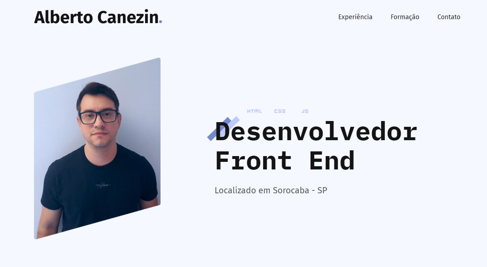
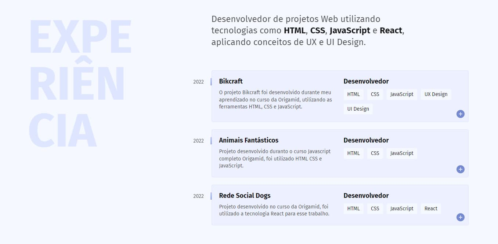
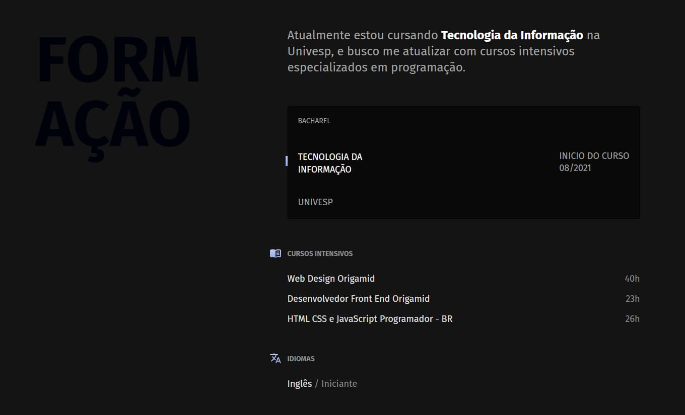
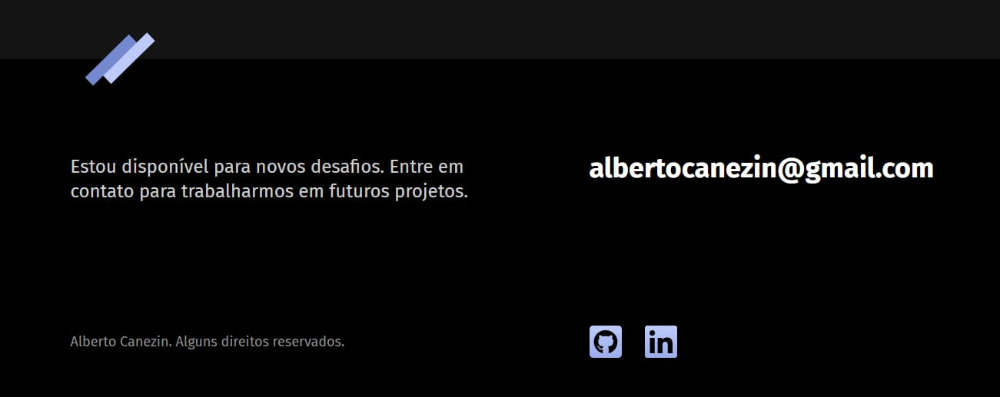

# Site Pessoal

<p style="font-size: 16px;">Este é meu site pessoal, onde coloco minhas experiências e meus projetos. <br>
</p>

- Foi desenvolvido com boas práticas de front end
- É totalmente responsivo
- Foi utilizado diversas técnicas com CSS3

## Técnologias Utilizadas

- JavaScript
- CSS3 - FlexBox - CSS Grid
- HTML5

## Visual do Site

<p>Introdução</p>


<br>
<p>Experiência</p>


<br>
<p>Formação</p>


<br>
<p>Footer</p>


## Visualize todo o projeto em

<a href="https://canezinbeto.github.io/" target="_blank">https://canezinbeto.github.io/</a>

## Para testar na sua máquina

<p>Pré-requisitos</p>
<p>Você precisa ter instalado na sua máquina as ferramentas: <a href="https://git-scm.com/">Git</a> e também <a href="https://code.visualstudio.com/">Vscode</a> com a extensão liveServer</p>

```bash
# Basta clonar o repositório em sua máquina
git@github.com:CanezinBeto/CanezinBeto.github.io.git

# Abrir com o Vscode e visualizar com o liveServer
```

Desenvolvido por Alberto Canezin :rocket: [veja meu LinkeIn](https://www.linkedin.com/in/albertocanezin-dev/)
